<details>
<summary>Graph</summary>

# Something

> \
> GradHardw\
> y\
> ss

- [ ] GradHardw DokuchaevaLiliia BoldakovDmytro KonnektZuferl
    - Grad - max. число соседей
    - Hardwareaufwand

Kantenkonnektivität - `min`\
_Netzwerk unterbrechen_<br>
Zuverlässigkeit

</details>

# Documentation

<details> <summary>Architekturdiagramme</summary>

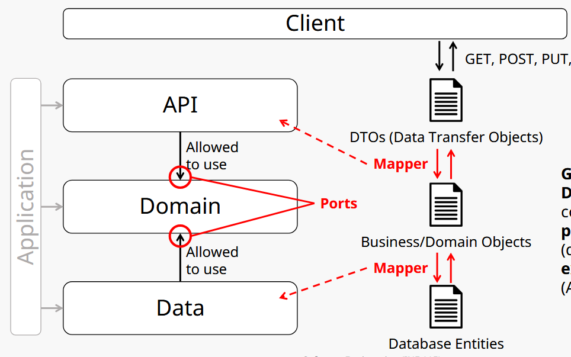

→ In CampusCoffee realisiert über Maven-Submodule
</details> <details> <summary>Documentation as Code</summary>

- Konzept: Dokumentation = Teil des Codes
    - Formate: Markdown
    - Tools: Git, Linter

</details> <details> <summary>Dokumentationsartefakte vs. Architekturelle Entscheidungen</summary>

- **Dokumentationsartefakte** = z. B. UML-Diagramme, Paketstrukturen, Code-Kommentare
- **Architekturelle Entscheidungen (ADRs)** = z. B. Microservices statt Monolith\
→ ADRs sind entscheidungsorientiert, Artefakte zustandsorientiert

</details> <details> <summary>Zweck von ADRs (Architectural Decision Records)</summary>

- Ziel: Dokumentation von Entscheidungen, die beeinflussen:
    - Architekturstruktur
    - Softwarequalität
    - Schnittstellen
→ z. B. Entscheidung für Microservices statt Monolith
</details>

# Code Reviews

<details>

<summary>Code Reviews (goal, pro, cons)</summary>

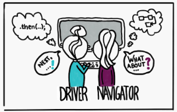\
Ziel: Konzentration auf Qualität, Probleme und Zusammenarbeit (*Pair Programming*)

- +:
    - Höhere Codequalität und Fehlervorbeugung
    - Wissenstransfer im Team
    - Gemeinsame Verantwortung für Code
- -:
    - Langsame Rückmeldung
    - Zu große Codeänderungen auf einmal
    - Konflikte im Review-Prozess
    - Aufwand für Reviewer (Zeit, Aufmerksamkeit)

</details>


<details>

<summary>Pull/Merge vs. Instant Reviews</summary>

- **Instant Reviews**: direkter und interaktiver, z. B. Pair Programming
- **PR-/MR-Reviews**: über Pull/Merge Requests, dokumentiert, besser für größere Teams
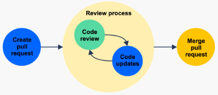
</details>


<details>

<summary>Essentielle vs. Akzidentelle Komplexität</summary>

- **Essentielle Komplexität**: ergibt sich aus der Natur des Problems (z. B. Mathe-Formel)
- **Akzidentelle Komplexität**: entsteht durch schlechte Architektur, fehlende Dokumentation\
→ Ziel: akzidentelle Komplexität minimieren

</details>


<details>

<summary>Top-down vs. Bottom-up Codeverständnis</summary>

- **Top-down**: Startet mit Vorwissen und Hypothesen → prüft durch Code-Analyse
- **Bottom-up**: Kein Vorwissen → Schrittweise Analyse von Code

</details>


<details>

<summary>Permissive vs. Copyleft Lizenzen</summary>

- **Permissive**: Erlaubt **private** Nutzung, Änderungen ohne Offenlegung (z. B. MIT, BSD, Apache)
- **Copyleft**: Änderungen müssen offen bleiben, open-source (z. B. GPL, CC BY-SA)

</details>


<details>

<summary>open-source vs. inner-source</summary>

- open-source: код открыт для всех
- inner-source: код открыт для сотрудников внутри компании

</details>

# Testing

⚠️ Branch Covering

<details>

<summary>Bug (verschiedene Bedeutungen)</summary>

- Mistake: “a human act or **decision** resulting in an error”
- Defect (bug): “an error in the program code” → **static**
- Fault: “an error in the program state” → **dynamic**
- Failure: “an externally **visible** error in the program behavior”
</details>


<details>

<summary>Testing vs. Debugging / Validation vs. Verification vs. Evaluation</summary>

- Testing: Nachweis, dass ein Fehler existiert (z.B. durch fehlschlagenden Test)
- Debugging: Lokalisieren und Beheben dieses Fehlers im Code

- Verification: Bauen wir das Produkt **richtig**? - Prüfung gegen Spezifikation\
    Проверяем, работает ли кнопка «Login» технически правильно (логин передаётся, ответ получен)
- Validation: Bauen wir das **richtige Produkt**? – Prüfung gegen Anforderungen
- Evaluation: Ist das System **nützlich** oder gut? - Prüfung mit echten Nutzer\
    Спрашиваем пользователя, удобно ли ему пользоваться кнопкой, понятна ли она, нужное ли место.
</details>


<details>

<summary>Unit vs. Integration vs. System vs. User Test</summary>

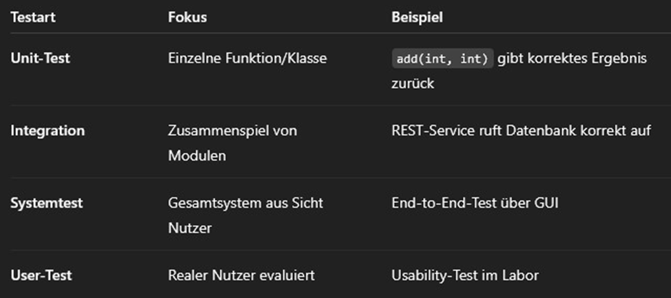
</details>


<details>
<summary>Test Fixtures</summary>

- preparing a fixed state/environment
</details>


<details>
<summary>Test Doubles</summary>

- isolating a class or component for testing
- Dummy — "болванка"
- Fake — "упрощённая копия"
- Stub — "предсказуемый ответ"
- Spy — "наблюдатель"
- Mock — "проверяющий и реагирующий"
</details>


<details>
<summary>Black Box vs. Glass Box Testing</summary>

- Black Box:
    - no info about code
    - nur Eingaben und Ausgaben werden betrachtet
    - Ziel: Äquivalenzklassen (Gruppe), Grenzwertanalyse

- Glass Box:
    - we know code
    - Ziel: alle Pfade, Zweige, Anweisungen abdecken
</details>


<details>
<summary>Coverage-Kriterien</summary>

- Statement Coverage (Anweisungsüberdeckung)
- Branch Coverage (Zweigüberdeckung)
- Path Coverage (Pfadüberdeckung)
- Condition Coverage
- → Berechnung: Anzahl erfüllter Elemente ÷ Gesamtanzahl × 100 %

</details>


<details>
<summary>Warum 100 % Coverage unrealistisch ist und keine Garantie fehlerhafter Software</summary>

- Fehler sind nicht immer in Pfaden unrealistisch oder schwer erreichbar
</details>


<details>
<summary>Test-Driven Development (TDD)</summary>


Prinzipien:
- Nur **so viel Code** schreiben, **wie nötig**, um Fehler zu vermeiden
- Sauberes **Refactoring**

Vorteile:
- Bessere **Testabdeckung**
- Frühe **Fehlererkennung**
</details>


# Modeling
[UML-Notationsübersicht](./images/UML-Notationsübersicht-2.5.pdf)
<details>

<summary>Modell vs. Diagramm</summary>

- Modell = **abstrakte** Darstellung eines Systems (z. B. Struktur); can be made out of many diagrams
- Diagramm = **grafische** Darstellung eines Teils dieses Modells (z. B. Klassendiagramm)
</details>


<details>
<summary>Zweck von Modellen</summary>

- Planung der Softwarearchitektur
- Kommunikation mit Stakeholdern
- Dokumentation des Systemdesigns
</details>


<details>
<summary>Types of Models</summary>

- Graphical (Syntax = elements, Semantic = meaning of elements) vs. Textual
- Black Box vs. Glass Box
- Static vs. Dynamic
</details>


<details>
<summary>OOM: Core Elements</summary>

- Classes
    - State → Attributes
    - Behavior → Methods
    - Static structure (hierarchy)
```java
public class MyClass {
    private int value;
    public MyClass(int value) {…}
    public void doSomething() {…}
}
```
- Objects (instances of classes)
    - Dynamic behavior
```java
MyClass obj1 = new MyClass(1);
MyClass obj2 = new MyClass(2);
obj1.doSomething();
```
</details>


<details>
<summary>statische vs. dynamische Modell</summary>

- Statisch: beschreibt die **Struktur** (z. B. Klassen, Attribute, Beziehungen)
- Dynamisch: beschreibt das **Verhalten über die Zeit** (z. B. Zustände, Aktivitäten, Nachrichten)
</details>


<details>
<summary>Prescriptive vs. Descriptive Model</summary>

- Prescriptive: vor der Implementierung; **wie** ein System gebaut werden soll; Design, Requirements Engineering
- Descriptive: nach der I; wie ein System **bereits ist**; Analyse, Dokumentation
    - **Domain Model** = what should be **included** in the system and what is **restricted**\
    Nutzt UML-Klassendiagramme, aber **ohne technische Details** -> verständlicher für Kunde
        - Object Design (Objektentwurf) = Technisches Design, wie Klassen zusammenarbeiten\
        konzentriert sich auf Klassenstruktur und Schnittstellen
        - System Design (Systementwurf) = Architektur\
        konzentriert sich auf Komponenten, Pakete, Subsysteme, Architektur
        - Domain-Driven Design (DDD) = Fachsprache + Struktur
</details>


<details>
<summary>UML-Diagramm: Klassen</summary>

- Klassendiagramm = statisch, zeigt Beziehungen zwischen Klassen (z. B. Vererbung)
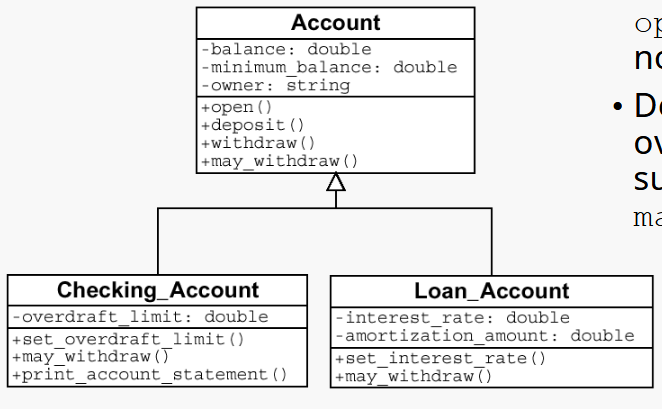
- Aktivitätsdiagramm = dynamisch, Kontroll- oder Datenfluess zwischen Aktivitäten in einem Prozess (typisch für Use Cases)
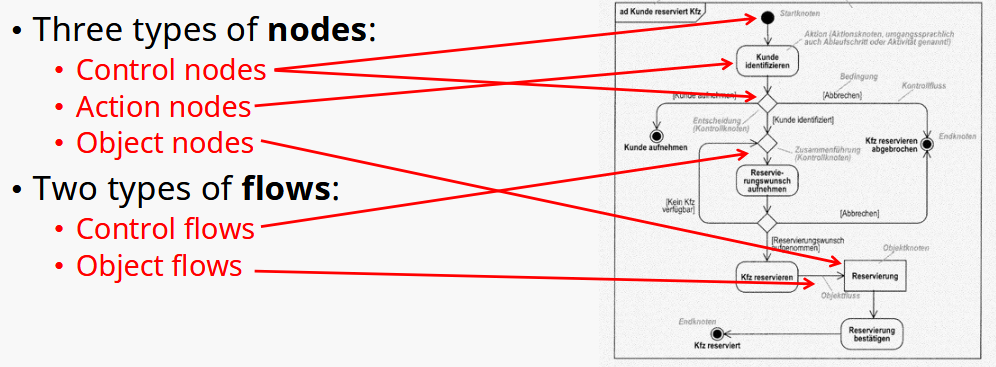
- Sequenzdiagramm = dynamisch, **zeitliche** Interaktionen zwischen Objekten\
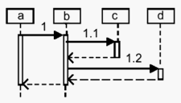
- Zustandsdiagramm = dynamisch, zeigt **mögliche Zustände** eines Objekts\
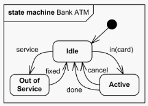
- Use Case Diagrams = dynamisch, actors, use cases, and their relationships
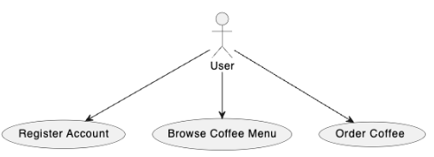
</details>


<details>
<summary>Aggregation vs. Komposition</summary>

- Komposition = can not exist without X
- Aggregation = can be connected to Y
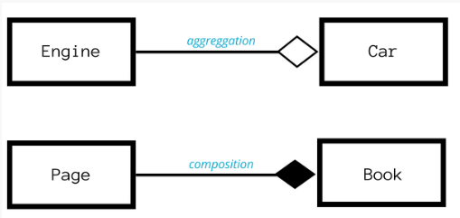\
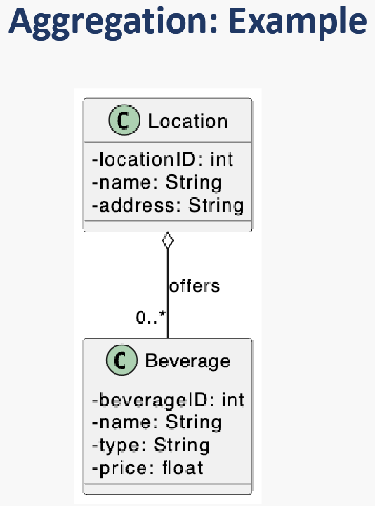
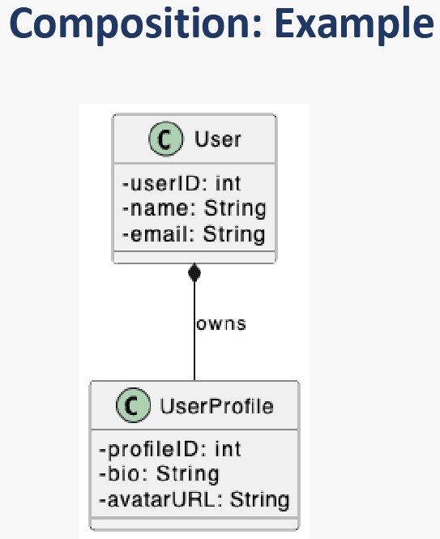
</details>


<details>
<summary>Constraints and Assertions</summary>

- Constraints → логика модели, действует всегда
- Assertions → временные проверки в коде, включаются только при необходимости
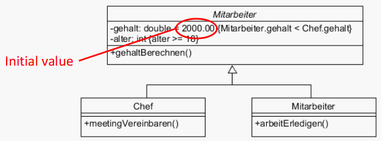
</details>

# Quality and Design Patterns

⚠️ UML diagrams
⚠️ Übungsblatt 8
<details>
<summary>Indikatoren für interne und externe Softwarequalität</summary>

- Intern: Lesbarkeit, Modularität, Testbarkeit, Wartbarkeit
- Extern: Zuverlässigkeit, Performance, Usability, Sicherheit, Portabilität
</details>


<details>
<summary>SOLID</summary>

- Single Responsibility – eine Klasse nur einen einzigen Grund haben sollte, sich
zu ändern
- Open/Closed – offen für Erweiterung, geschlossen für Änderung
- Liskov Substitution – Unterklassen müssen durch Oberklassen ersetzbar sein
- Interface Segregation – lieber viele kleine Interfaces als ein großes
- Dependency Inversion – Abhängigkeiten von Interfaces, nicht von konkreten Klassen (da leicht testbar)
</details>


<details>
<summary>Motivation hinter SOLID</summary>

- Code wird **modularer, testbarer, wartbarer**
- **Änderungen** verursachen weniger Fehler
- Förderung von **loser Kopplung und hoher Kohäsion**
    - Lose Kopplung: Komponenten sind nur schwach voneinander abhängig
    - Hohe Kohäsion: Innerhalb eines Moduls ist alles thematisch zusammengehörig, keine vermischte Logik\
    cohesion vs. coupling
    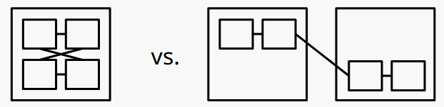
</details>


<details>
<summary>Vererbung vs. Delegation</summary>

**Vererbung**:
```java
class Animal { void eat() {...} }
class Dog extends Animal { void bark() {...} }
```
➡️ Dog ist ein Animal (is-a)

**Delegation**:
```java
class Worker { void work() {...} }
class Manager {
  Worker w = new Worker();
  void work() { w.work(); }
}
```
➡️ Manager hat einen Worker (has-a)
</details>


<details>
<summary>Design Pattern: Categories</summary>

- 🏗️ Creational: Objekterstellung flexibel und **unabhängig von konkreten Klassen** gestalten
    - Singleton
    - Factory
- 🧱 Structural: Strukturierung von Klassen und Objekten zur effizienten **Zusammensetzung** 
    - Composite - Baumstruktur z.B. UI-Menü
- 🔁 Behavioral: Beschreiben die **Kommunikation** und Kontrolle **zwischen Objekten** 
    - Observer - Notifications <details><summary>🖼️</summary>
        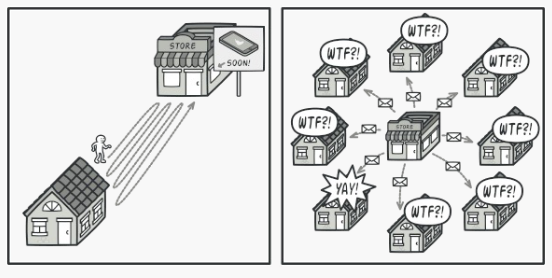</details>
- 🧩 Architectural: **Struktur ganzer Softwaresysteme** definieren 
    - Model-View-Controller - Trennung von Logik und UI
- ⚙️ Concurrency: Unterstützung von **Multithreading** und Nebenläufigkeit 
    - Monitor - kontrollierter Zugriff auf Ressourcen
</details>


<details>
<summary>Factory (in creational pattern)</summary>
Ziel: Instanziierungslogik von Objekten zu kapseln

❌ Ohne Kapselung:
```java
Button button = new WindowsButton();
```
✅ Mit Kapselung durch Factory:
```java
Button button = ButtonFactory.createButton();
```
Und inner `ButtonFactory`:
```java
public static Button createButton() {
    return new WindowsButton(); // oder später: new LinuxButton()
}
```
🔁 Vorteil:
- Lose Kopplung
- Testbarkeit
</details>


<details>
<summary>Singleton Pattern or Antipattern</summary>

- Singleton = stellt sicher, dass **nur eine Instanz existiert**


| Situation                       | Singleton gut? |
| ------------------------------- | -------------- |
| Konfiguration, Logger            | ✅          |
| DB | ❌    |
| Testen         | ❌   |
| Spring        | ❌     |

🧠 Wann verwenden?
- Wenn man **wirklich nur eine Instanz** braucht
- Wenn der **Zustand sich nicht ändert**

🚫 Wann vermeiden?
- Wenn du **testen**, austauschen oder **flexibel** bleiben willst
- Wenn du statt `new` besser **Dependency Injection** nutzen kannst

📌 Kurz gesagt:

    Singleton ist manchmal praktisch – aber oft besser vermeiden!

</details>

# Evolution and Maintenance

<details>
<summary>Warum ändert sich Software im Laufe der Zeit?</summary>

- Neue Anforderungen
- Fehler müssen behoben werden
- Unterstützung für neue Hardware ist nötig
- Performance und Usability sollen verbessert werden
</details>


<details>
<summary>Änderungsmanagement in traditionellen vs. agilen Projekten</summary>

- Traditionell (z. B. V-Modell):
    - Formale Änderungsanträge, viele Genehmigungen
    - Änderungen sind teuer und aufwendig

- Agil (z. B. Scrum):
    - Änderungen werden flexibel in Sprints aufgenommen
    - Fokus auf schnelle Reaktion statt Planung
</details>


<details>
<summary>Evolution vs. Maintenance</summary>

- Maintenance: Reaktion auf Fehler
- Evolution: Kontinuierliche Weiterentwicklung und Verbesserung
</details>


<details>
<summary>Metapher der technischen Schulden</summary>

Technische Schulden (_engl. Technical Debt_) sind eine Metapher, die entwickelt wurde, um zu erklären, was passiert, wenn Entwickler **schnelle, aber unsaubere Entscheidungen treffen**, um eine Funktion möglichst schnell zu veröffentlichen.

Beispiele solcher Entscheidungen:
- Schwer lesbarer Code
- Fehlende Tests
- Ignorieren von Architekturprinzipien

🔸 Warum nennt man das „Schulden“?

Wie bei finanziellen Schulden:
- Man bekommt sofort einen **Vorteil** – man liefert schneller
- Aber man zahlt später **„Zinsen“** – z. B. durch schlechtere Wartbarkeit, mehr Bugs oder längere Entwicklungszeit
- Wenn man die Schulden nicht „zurückzahlt“ (z. B. durch Refactoring), **„geht das Projekt bankrott“** – das System wird zu kompliziert, um es zu pflegen oder zu erweitern

</details>


<details>
<summary>Refactoring vs. Reengineering</summary>

- Refactoring = Umstrukturierung des Quellcodes ohne Änderung der Funktionalität, um **Lesbarkeit, Wartbarkeit oder Erweiterbarkeit zu verbessern**
- Reengineering = **Größere Umstrukturierung**, oft inklusive neuer Technologien, aber ebenfalls ohne Änderung der Funktionalität

⭐ Refactoring ist kontinuierlich, Reengineering eher punktuell und aufwendig.
</details>


<details>
<summary>Anti-Pattern</summary>

- Anti-Pattern = eine Lösung, die zunächst wirksam erscheint, aber **mehr Schaden als Nutzen verursacht**, obwohl eine bessere Alternative verfügbar ist.\
**Beispiel**: The Blob\
→ Ein Objekt übernimmt zu viele Verantwortlichkeiten, während andere Klassen nur Daten halten.\
Lösung: Verantwortlichkeiten gleichmäßiger verteilen (z. B. durch Refactoring).
</details>


<details>
<summary>Code Smell</summary>

- Code Smell = der Code funktioniert, ist aber schwer verständlich, erweiterbar oder testbar.\
**Beispiel**: Lange Methoden\
→ Schwer verständlich und wartbar.\
Lösung: Aufteilen in kleinere, logisch getrennte Methoden.
</details>


<details>
<summary>Anti-Pattern vs. Code Smell</summary>

- Code Smell = kleines Warnzeichen im Code
- Anti-Pattern = komplette fehlerhafte Vorgehensweise oder Struktur
</details>

# Measures and Metrics
⚠️ CFG
<details>
<summary>Measure vs. Metric</summary>

- Eine Measure = direkt beobachteter Rohwert (z. B. Lines of Code)
- Metric = Measures interpretiert und kombiniert, um abstrakte Eigenschaften zu bewerten (z. B. Wartbarkeit)
</details>


<details>
<summary>Warum quantitative MM als Ziel problematisch sind?</summary>

1. Goodhart’s Law:

    >„Wenn eine Metrik zum Ziel wird, verliert sie ihren Aussagewert.“

    → Beispiel: Wenn Testabdeckung Ziel ist, werden unnötige Tests geschrieben.

2. Metrik ≠ Qualität:\
Hoher Zahlenwert bedeutet nicht automatisch gute Softwarequalität.

3. Manipulation:\
Entwickler optimieren auf die Zahl, nicht auf das Ergebnis.

⭐ Metriken lieber **zur Beobachtung und Analyse** verwenden – nicht als starre Ziele.
</details>


<details>
<summary>quantitative vs. qualitative Daten</summary>

- **Quantitativ**: Zahlenbasiert, skalierbar, automatisierbar, z. B. Messwerte.

- **Qualitativ**: Kontextreich, tieferes Verständnis, z. B. Interviews.

- **Skalierbarkeit**: Quantitative → gut skalierbar, qualitative → schwer skalierbar.

- **Erkenntnisse**: Qualitativ zeigt oft das „Warum“, quantitativ das „Was“.
</details>


<details>
<summary>Komplexität und Größe von MM</summary>

- Komplex ≠ Unverständlich\
Ein Programm kann strukturell komplex, aber trotzdem leicht verständlich sein – und umgekehrt.

- Großer Code wirkt oft „schlechter“ in den Metriken, auch wenn er gut strukturiert ist.

- Qualitätsaspekte wie Modularität oder Lesbarkeit oft unberücksichtigt \
→ Metriken liefern kein vollständiges Bild der Codequalität

⭐ Metriken sind nützlich, sollten aber **nicht blind vertraut**, sondern **im Kontext interpretiert** werden.
</details>


<details>
<summary>Halstead- und McCabe-Metriken berechnen (für Java-Methoden)</summary>

- Halstead:
    - Wie gut ist der Code **verständlich und wartbar**?
    - Je höher D, desto schwieriger ist der Code zu verstehen und zu warten <details><summary>🖼️</summary>
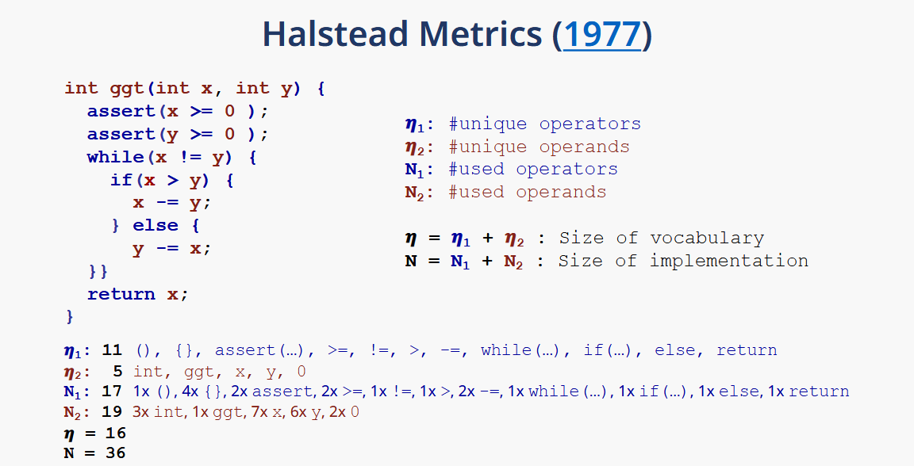
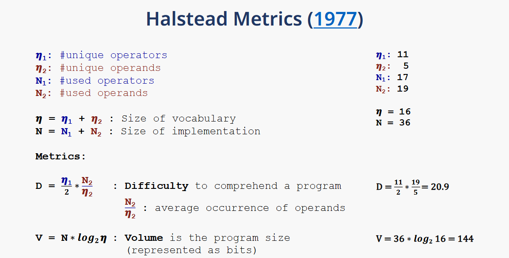</details>
- McCabe:
    - Wie gut ist der Code **testbar**?
    - bei CFG ⚠️
    - Formel: V(G) = E − N + 2 (E: Kanten, N: Knoten im CFG)
    - Je höher der Wert, desto höher das *Fehlerrisiko* und desto *aufwändiger die Tests*
</details>


<details>
<summary>levels of measurement (“Skalenniveau”)</summary>

- Nominal = named (genotype, blood type, zip code).
- Ordinal = +order matters (size {S, M, L}).
- Interval = +difference matters (shoe size).
- Ratio = +true zero (weight of luggage).
</details>


<details>
<summary>Big Data vs. Thick Data</summary>

🔹 Big Data:

- **Quantitativ**, stark strukturiert oder semi-strukturiert
- Große Datenmengen, z. B. aus Logfiles, Sensoren, Tracking
- Automatisch analysierbar mit Statistik, Machine Learning
- Gut skalierbar, erkennt Muster
- **Schwäche**: Liefert wenig Kontext, beantwortet selten das „Warum?“

Beispiel:
„1000 Nutzer haben auf Button X geklickt.“

🔹 Thick Data:

- **Qualitativ**, unstrukturiert oder halbstrukturiert
- Entsteht durch Interviews, Beobachtungen, ethnografische Studien
- Liefert tiefe Einblicke in Motivation, Denken, Verhalten
- Aufwendig, nicht leicht skalierbar
- **Stärke**: Liefert Kontext, erklärt das „Warum?“ hinter Mustern

Beispiel:
„Warum klicken Nutzer auf Button X?“

⭐ Zusammenfassung:

- Big Data zeigt Trends.
- Thick Data erklärt, warum diese Trends entstehen.

Ideal ist eine Kombination beider Ansätze.
</details>

# Managing Projects

<details>
<summary>Warum ist Organisation in Softwareprojekten wichtig?</summary>

- **Koordination** wird mit Teamgröße komplexer  
- Reduziert **Missverständnisse**
- Transparente **Kommunikation**

</details>


<details>
<summary>Scrum: Arbeitsorganisation</summary>

- **Planung:** Sprint Planning mit PO, Dev-Team, Scrum Master  
- **Schätzung:** Story Points (oft mit Planning Poker)  
- **Tools:** Jira, GitHub Boards
- **Struktur:** Product Backlog, Sprint Backlog, Task Board

</details>


<details>
<summary>Product Backlog Items</summary>

- **User Story:** Wunsch/Funktion aus Nutzersicht\
    *„Als Kunde will ich mich einloggen…“*
- **Task:** konkrete technische Umsetzung (Teil der Story)\
    *„Login-Button erstellen“*
- **Bug Report:** Fehlerbeschreibung, inkl. Reproduktionsschritte  
++ **PO** is responsible\
++ **Backlog Grooming/Story Time** - Goal: Having a collection of small, **well-understood stories** at the top of the product backlog
</details>


<details>
<summary>Sprint Planning</summary>

- **PO** proposes **what** should be done
- **Team** decides **how**
- **SM organisiert** Meeting

</details>


<details>
<summary>Definition of Done (DoD) vs. Definition of Ready (DoR)</summary>

|                        | **DoR – „Bereit zur Umsetzung“**                                                                                                                                                   | **DoD – „Fertig zur Auslieferung“**                                                                                               |
| ---------------------- | ---------------------------------------------------------------------------------------------------------------------------------------------------------------------------------- | --------------------------------------------------------------------------------------------------------------------------------- |
| **Frage**              | „Können wir diese Aufgabe im Sprint starten?“                                                                                                                                      | „Ist diese Aufgabe komplett abgeschlossen?“                                                                                       |
| **Ziel**               | Sicherstellen, dass **die Aufgabe klar und planbar** ist                                                                                                                           | Sicherstellen, dass **die Arbeit vollständig und qualitätsgesichert** ist                                                         |
| **Typische Kriterien** | • User Story im richtigen Format („Als … will ich …“)<br>• Akzeptanzkriterien definiert<br>• Aufwand geschätzt (z. B. Story Points)<br>• Keine Blocker oder externe Abhängigkeiten (z.B. fehlt API) | • Code funktioniert und ist getestet<br>• Tests grün, Code-Review erledigt<br>• Dokumentation aktualisiert |
| **Zeitpunkt**          | **Vor** dem Sprint-Planning                                                                                                                                                        | **Nach** der Umsetzung, vor Abschluss                                                                                             |

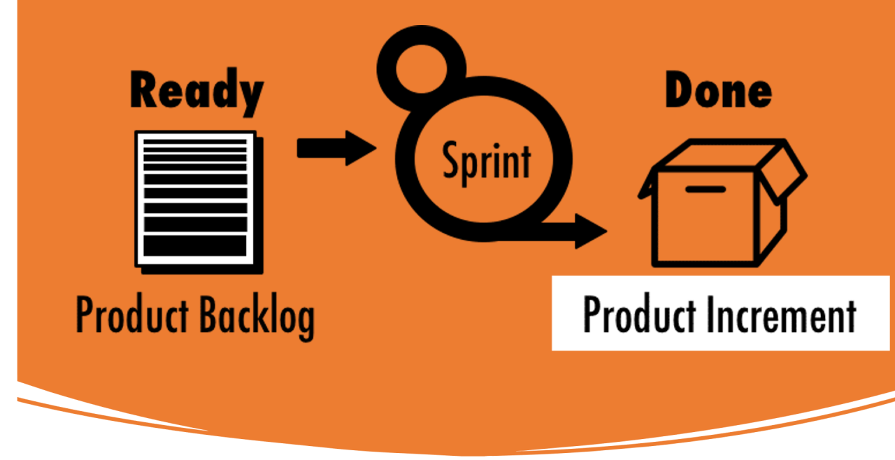
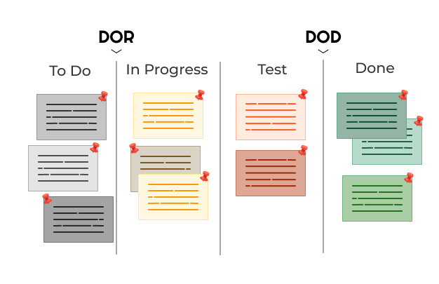
</details>


<details>
<summary>Aufwandsschätzung (effort estimation) & Aktivitätsplanung (activity planning)</summary>

- **Ziel:** realistische Planung, Team-Kapazität berücksichtigen
- **Strategien:** 
    - Story Points - Fibonacci-Reihe; „Story X ist doppelt so aufwendig wie Story Y“
    - Team is responsible
    - Task Points - wie SP, aber auf konkrete Tasks
    - T-Shirt-Größen - XS, S, M, L, XL; später durch SP ersetzt
    - Planning Poker - jeder zeigt Karte (= SP) gleichzeitig (to avoid bias), danach Diskussion
- **Velocity:** Durchschnittlich **erledigte SP** pro Sprint\
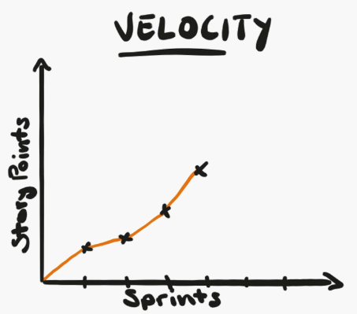

</details>


<details>
<summary>Gantt-Diagramm</summary>

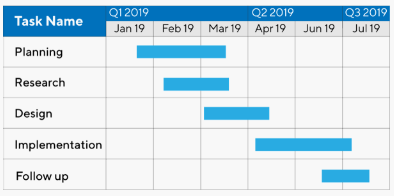\
can be **with** activity dependencies and **without**
- Ziel **Critical Path Method (CPM)**:
    - **Gesamtdauer** des Projekts berechnen
    - Kritischen Pfad finden (d. h. der längste Pfad → bestimmt die Projektdauer)
    - **Pufferzeiten (Slack)** anderer Aktivitäten erkennen (Zeit, um die man eine Aktivität verzögern kann, ohne das Projekt zu gefährden)
- Berechnung:
Kritischer Pfad:\
A → B → D = 3+2+5 = 10 Tage\
A → C → E = 3+4+1 = 8 Tage → nicht kritisch

</details>

# Cloud

<details>
<summary>scalability vs. elasticity</summary>

**Scalability** bedeutet, dass ein System **überhaupt wachsen kann** (z. B. horizontal/vertikal), aber **nicht zwingend automatisch**\
**Elasticity** bedeutet, **inwieweit** eine Cloud-Schicht autonom ihre Kapazität an die Arbeitslast aber die Zeit anpasst.

</details>


<details>
<summary>billing approaches</summary>

- Pay-as-you-go: Nur bezahlen, was man nutzt
- Subscription-based billing: flat rate, 1-3 years
- Hybrid approaches
- Special offers: Free-Tier
</details>


<details>
<summary>Container vs. Docker vs. Kubernetes</summary>

**Container**: ein leichtgewichtiges, eigenständiges Software-Paket, das Code, Laufzeit und Abhängigkeiten beinhaltet
**Docker**: Verpackt Anwendungen in Container (mit allen Abhängigkeiten) → überall lauffähig\
**Kubernetes**: Orchestriert und verwaltet viele Container → Skalierung, Load Balancing, Selbstheilung
</details>


<details>
<summary>Testcontainers</summary>

- 🧪 Что делает Testcontainers?
    - Запускает реальные сервисы (например, PostgreSQL, Redis, Kafka) в Docker-контейнерах
    - Используется в юнит-тестах и интеграционных тестах
    - Контейнер автоматически стартует перед тестом и удаляется после него
- 🧪 Vorteil von Testcontainers
    - **Realistische Tests** mit echten Datenbanken in Containern
    - Besser als In-Memory-DBs, weil **Verhalten näher an Produktion**
    - **Automatisiertes Setup** und **Cleanup pro Test**
</details>


<details>
<summary>⚠️ Maven Default Lifecycle</summary>

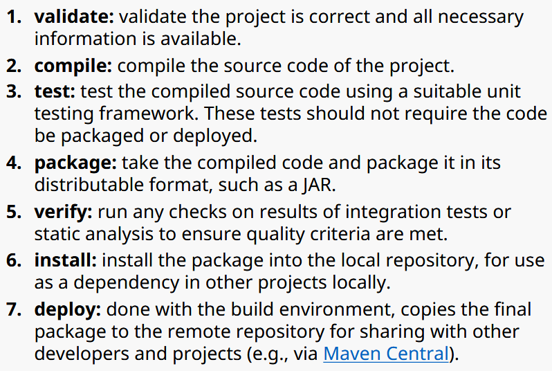\
</details>